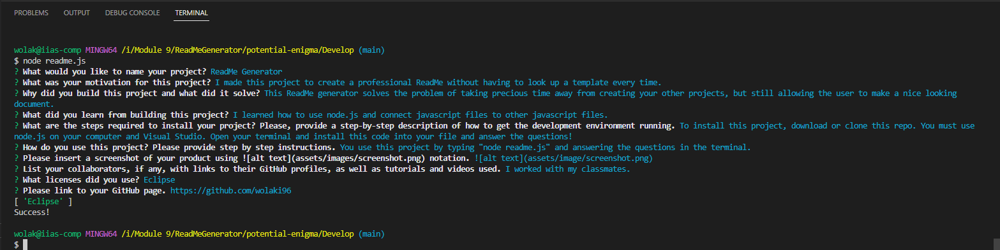
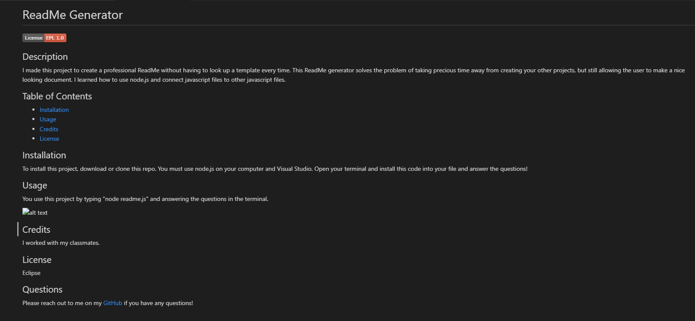

# ReadMe Generator

 
  
## Description
I made this project to create a professional ReadMe without having to look up a template every time I needed to create a readme file. This ReadMe generator solves the problem of taking precious time away from creating your other projects, but still allows time for a nice looking document to present your project. By creating this generator, I learned about the basics of working in node.js and exploring programming and developing outside of the browser.

## Table of Contents

- [Installation](#installation)
- [Usage](#usage)
- [Credits](#credits)
- [License](#license)

## Installation

To install this project, make sure that you have node.js installed on your computer. Then clone this repo into your VS Code.

## Usage

To use this project, type "node readme.js" into your terminal and simply answer all the questions about your project process.

 This image shows how the termainal will look while inserting your questions.  This demonstrates your finished product. 
    

## Credits

I received help from the UCF bootcamp homework and examples. I also got help from a fellow classmate Youssef Ojeil, who you can reach at [GitHub](https://github.com/youssefojeil).

## License

None

## Questions

Please reach out to me on my [GitHub](github.com/wolaki96) or my email at wolaki96@gmail.com if you have any questions!

